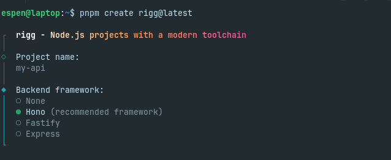

# rigg

<p>
<a href="https://npmx.dev/package/create-rigg"></a>
</p>

**Create Node.js projects with a modern toolchain**

I really like what [VoidZero](https://voidzero.dev) and [Vite+](https://github.com/voidzero-dev/vite-plus) are doing for web development. **rigg** brings the same toolchain to every Node.js project outside the browser. Use it for backends, CLIs, libraries, scripts, whatever you're building.



## Create a new project with rigg

```bash
# pnpm
pnpm create rigg@latest

# npm
npm create rigg@latest

# bun
bun create rigg@latest

# yarn
yarn create rigg@latest
```

## What you get

A project created with rigg gets most of the same tools as in the Vite+ toolchain.

| Tool                                               | Role               |
| -------------------------------------------------- | ------------------ |
| [Vitest](https://vitest.dev)                       | Testing            |
| [Oxlint](https://oxc.rs/docs/guide/usage/linter)   | Linting            |
| [Oxfmt](https://oxc.rs/docs/guide/usage/formatter) | Formatting         |
| [tsdown](https://tsdown.dev)                       | Build              |
| [tsx](https://tsx.is)                              | Dev-mode execution |

### Backend framework

You can also choose one of the following backend frameworks:

- **Hono** - lightweight, modern API framework
- **Fastify** - fast and low overhead
- **Express** - familiar and widely supported
- **None** - where you don't need a backend framework, or you want to pick your own.

## Scripts

Every generated project includes:

```bash
pnpm dev        # Run with tsx (no build step)
pnpm build      # Build with tsdown
pnpm test       # Run Vitest
pnpm check      # Lint + format check + type check
pnpm fmt        # Format
pnpm fmt:check  # Check formatting without writing
pnpm lint       # Lint
pnpm lint:fix   # Lint with auto-fix
```

You can also use `npm` or `yarn` or `bun`, depending on your package manager.

## License

MIT

## Author

- [Espen Steen](https://github.com/ehs5)
